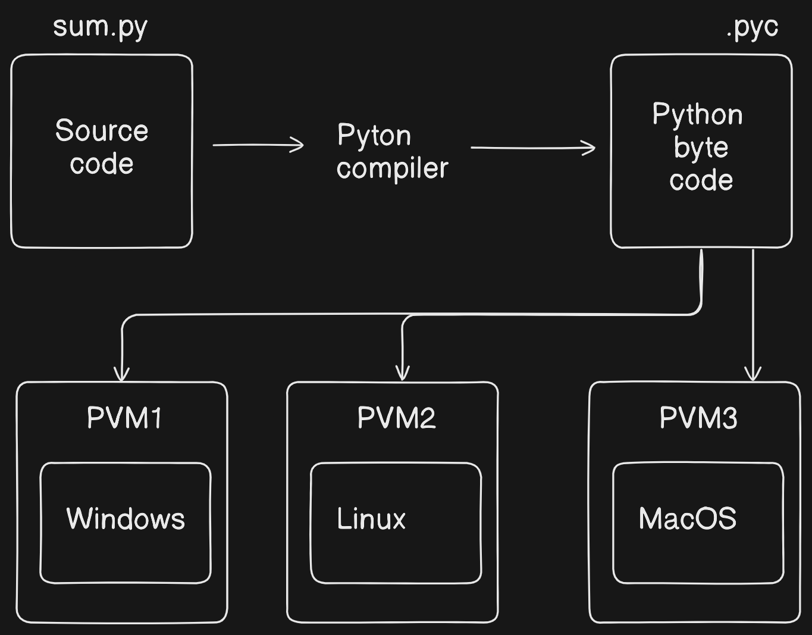
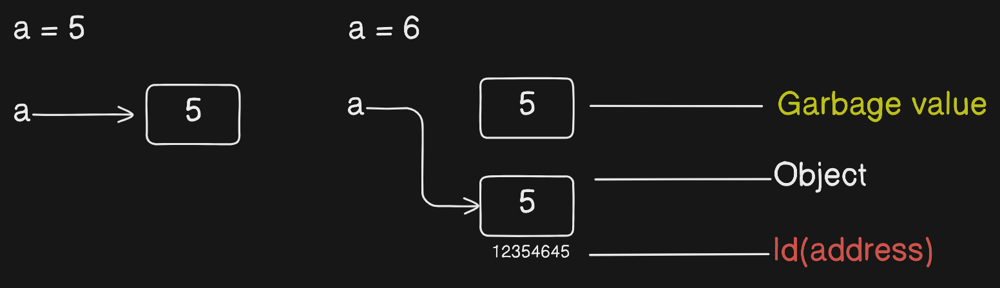
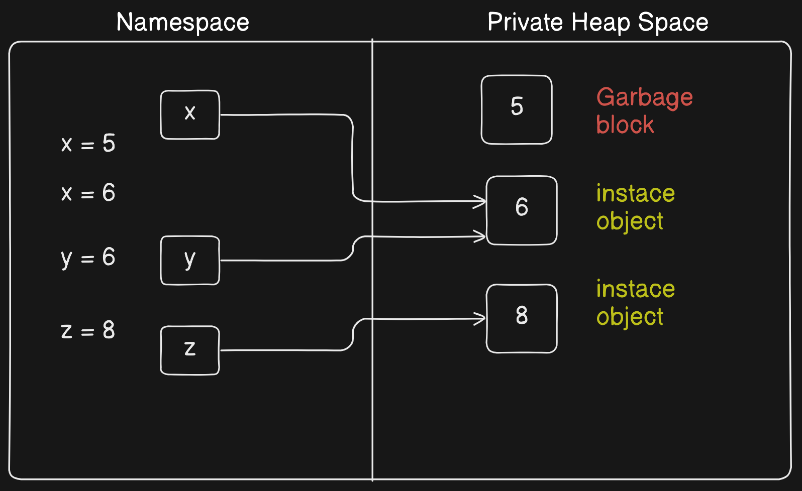
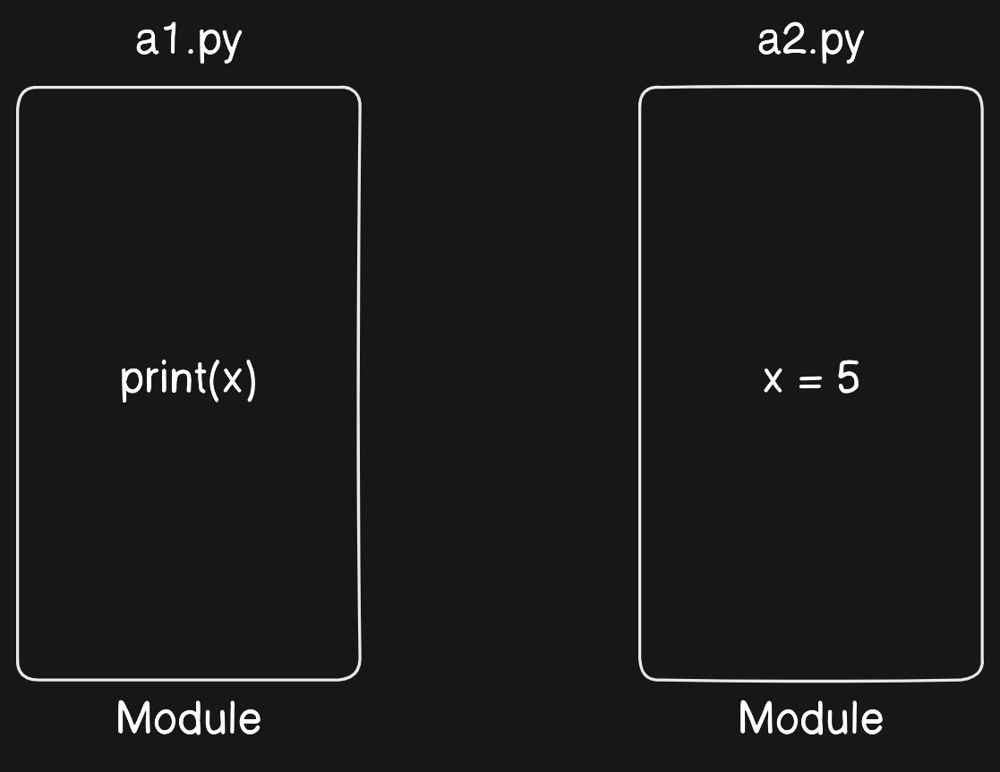
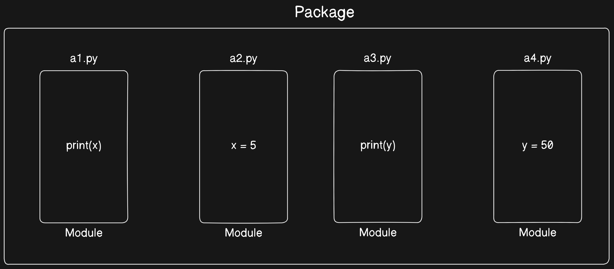

# Python Core Notes

### Introduction

- Dveoped by Guido Van Rossum in 1980s.
- He Devloped this language while working on a programming language named **ABC.**
- Name **python** is taken from the T.V show in America **_The Complete Monty Python's Flying Circus._**

### Why Python?

1. Huge community Support.
2. Future is AI.
3. Easy to learn and Implement.
4. General Purpose programming language.

### Features of Python?

- Highly Extensible.
- Simple and straight forword.
- Dynamic Type language. (varible declare at run time)
- Large libraries.
- Platform independent.
- Precise Coding.

### Facts of python

- Ranked #1 (TIOBE)
- Reduce code almost 1/6th times.

### Where python can be used?

- Devloping website.
- Task automation.
- AI, ML, IOT.
- Data Analysis.
- Data Visualisation.
- Devloping desktop & mobile applications.

---

## PVM (Python virtual machine)

- It is type of **_software_** which enable our python code to run on multiple platforms.

- It takes byte code instruction to convert into machine code instruction and display final output.

**_Note_**: PVM is machine dependent.



- PVM consists two things 1.Interpreter 2. Memory Manager.


- **Interpreter**: It executes the code line by line.

### How to generate .pyc compile file?

- Compile file is mainly given when we have to delvier the software after completion.

CMD: `python3 -m py_compile your_script.py`

---

## Pthon Comments

- Comments helps reader to understand the code which is written by other programmers.

- Comments were ignored by python interpreter.

### Types of python comments

1. Single line comment.
2. Multiple line comment.

### How to wrtie single line comment?

- Use # symbol.

```python
# Sum of two numbers
```

### How to wrtie multi line comment?

- Use """ """

```python
"""
This is my multiline comment
"""
```

---

## Variables

- Variables are the memory locations where data is saved.

- **_In Python,_** no variable declaration is required like c or c++

```python
# variable
a = 10
```



- **Garbage value**: means no variable is referring to that particular object.
- **Id**: Id belongs to that particular object.

### Rules for declaring Variable name

1. It is combination of alphabet, digit, and underscore.
2. cannot start with digit.
3. variable names is case sensitive.
4. Keywords cannot be used as variable names.

### Deleting a variable

- To delete a variable use del keyword along with variable name.
- Example: `del a`

### To know data type

- use `type(variable_name)`

---

## Python Data Types

### Numeric Types

- `int`: Integer numbers
- `float`: Floating-point numbers
- `complex`: Complex numbers

### Sequence Types

- `list`: Ordered, mutable sequences
- `tuple`: Ordered, immutable sequences
- `range`: Immutable sequence of numbers

### Text Type

- `str`: Strings (immutable sequences of Unicode characters)

### Mapping Type

- `dict`: Dictionaries (key-value pairs)

### Set Types

- `set`: Mutable sets
- `frozenset`: Immutable sets

### Boolean Type

- `bool`: Boolean values (True or False)

### Binary Types

- `bytes`: Immutable sequences of bytes
- `bytearray`: Mutable sequences of bytes
- `memoryview`: Memory views of bytes-like objects

### None Type

- `NoneType`: The None object, representing null or no value

```python
# Numeric types
integer = 42
float_number = 3.14
complex_number = 1 + 2j

# Sequence types
my_list = [1, 2, 3]
my_tuple = (1, 2, 3)
my_range = range(5)

# String
my_string = "Hello, World!"

# Dictionary
my_dict = {"key": "value"}

# Set types
my_set = {1, 2, 3}
my_frozenset = frozenset([1, 2, 3])

# Boolean
is_true = True

# Binary types
my_bytes = b"hello"
my_bytearray = bytearray(5)
my_memoryview = memoryview(bytes(5))

# None
my_none = None

```

---

## Memory Mangaement



**_Note:_** If you delete x variable then it will only delete the **reference varaible** but it will not delete the **instance object**. Then those objects also become garbage value.

### Garbage collection

- It is a program invoked by python itself whenever required whose job is to release garbage blocks.
- It is also known as automatic garbage management.

---

## Print function

- It is mainly used to display the values on the monitor.

- whenever you try to print multiple values in print then it will print those values by adding a space as default seperator.

- You can custimize your seperator using **sep=""** in print function.

### sep = " "

- Here a comma and space will be treated as seperator

```python
print(a,b,c,sep=", ") # 10, (10+3j), 10
```

### end = " "

```python
print(a,b) # 10 (10+3j)
print(c,d) # 10 20

# end
print(a,b,end=",") # 10, (10+3j), 10
print(c,d)
```

### Format Specifiers
```python
# format specifiers
age = 20
print("value of age is %d"%(x))
y = "Ankit"
print("Name is %s and age is %d" %(y,age) )
```

--- 
## Import in python

- Before diving into the import let's discuss the module, package, and library
1. **Module**: Our python file is a module.

2. **Package**: Collection of module is known as Package.

2. **Library**: Collection of package is known as library.

### import
```py
# Importing whole module
import operations

# importing only particular things from a module
from bioData import name, age

print(operations.sum)
print(operations.mul)

print("Your name is %s and age is %d "%(name,age))
```

- we can also import data from another module using alias.
```py
from operations import sum as add
```

### keywords
- Keywords are the predefine words in python.
- example: false,name, class, or, try, etc

---
## Type conversion
- There is mainly two type converions
1. **Implicit conversion:** Automatic conversion.
```py
a = 10 #int
b = 10.5 #float
print(a + b) # float --> 20.5
```

2. **Explicit conversion:** Forcefully conversion.
```py
num_str = "10"
num_int = int(num_str)
print(num_int)  # Output: 10

num_float = float(num_str)
print(num_float)  # Output: 10.0
```

--- 
## Input in python
- Inputs can be taken using `input()` function in python.
- `input()` can take at most one argument of str type.
- `input()` always return string type values.

```py
x = (input("Enter value of X"))
y = int(input("Enter value of Y"))
z = float(input())
comp = complex(input())

print(type(x), type(y), type(z), type(comp)) #<class 'str'> <class 'int'> <class 'float'> <class 'complex'>
print(x) #Ankit Choubey
```
---
## Operators in python
### 1.Arithmetic operator
- +,-, *, **,,//, /,%
- **Division** `/`: this will always give result in float.
- **Floor division** `//`: result in always floor value and if any operand is float then ans will be in float.

```py
print(17/2) # 8.5
print(17//2)# 8
```

### 2. Relational operators
- <=, >=, !=, ==, etc

### 3. Logical operators
- and, or, not
- Logical operators should be wrtiten in ***lowercase***
```py
# Logical operator
print('logical operator')
print(not True)
print(not 0)
```

### 3. Bitwise operators
- Bitwise mainly deals with the binary numbers
- &, |, ~, ^ (xor), >>, <<

```py
#Bitwise and
0&0 -> 0
0&1 -> 1
1&1 -> 1
1&0 ->0
#Bitwise or
0|0 ->0
0|1 ->1
1|1 ->1
1|0 ->1

# Bitwise xor: here if both values are oppsite then result will be 1
0^0 -> 0
0^1 ->1
1^1 ->0
1^0 ->1
```
### 4. Assisgnment operator
- =, +=, -=, *=,etc.
- Left side always consist a variable. `a *= 5`

### 5. Identity operator
- `is`, `is not`
- Here, `is` manly compare object Id of variables.
- `x is y`
```py
x = 34
y = 34

print(x is y) #true
```

### 6. Membership operator
- `in`, `not in`.
- To use membership operator there is some condition.
- These operator are applicable only on container(iterables).
- They result True or False value.
```py
# membership operator
list = [12,23,54,65]
print('is 23 is present?',23 in list) #true
```
---
## Control Statements


### Match statement
- Match statement is very similar to `switch` case in c, C++
```py
x = int(input("Enter number: "))

match x:
    case 1:
        print("one")
    case 2:
        print("Two")
    case 3:
        print("Three")
    case 4:
        print("Four")
```

- **Note:** `break` keyword connot be used in match block.

---
## File Handling

- The key function for working with files in Python is the open() function.

- The `open()` function takes two parameters; **filename**, and **mode**.

- There are four different methods (modes) for opening a file:
1. "r" - Read - Default value. Opens a file for reading, error if the file does not exist

2. "a" - Append - Opens a file for appending, creates the file if it does not exist

3. "w" - Write - Opens a file for writing, creates the file if it does not exist

4. "x" - Create - Creates the specified file, returns an error if the file exists

In addition you can specify if the file should be handled as binary or text mode

- "t" - Text - Default value. Text mode

- "b" - Binary - Binary mode (e.g. images)

### Reading from file
```py
f = open("demofile.txt", "r")
print(f.read())
```
- It will give you an error if the file is not found.

### Creating file
```py
#create 
f = open("myFile.txt", "x") # creating file
f.close()
```

### writing file
```py
f = open("myFile.txt", "w") # write will overwrite the content of the file
f.write("This is something which is written using python file write funtion.")
f.close()
```

### appending file
```py
# append 
f = open("myFile.txt", "a") # appending into file
f.write(" This is new code written using the python")
f.close()
```

---
## Python Loops

- Python has two primitive loop commands:

1. while loops
2. for loops

### The while Loop

- With the while loop we can execute a set of statements as long as a condition is true.

```py
count = 0
while(count <= 5):
    print(count, " Ankit") # 6 times Ankit
    count+=1

# break statement
i = 0
while i < 6:
  i += 1
  if i == 3:
    break
  print(i) # 0 1 2

#continue statement
i = 0
while i < 6:
  i += 1
  if i == 3:
    continue # 3 will be skiped from iteration
  print(i) # 0 1 2 4 5
```
- Here, `break` is a keyword which is used to stop the loop and transfer the control to outside the loop.
- `continue` is also a keyword used to skip that particular iteration.
- `pass` keyword is used to create empty block
```py
if condition:
    pass

#example 2
while(condition):
```

- ***Note:***: `while loop` is used when no. of iteration unknown.

### For loop

- A for loop is used for iterating over a sequence (that is either a list, a tuple, a dictionary, a set, or a string).

```py
fruits = ["apple", "banana", "cherry"]
for x in fruits:
  print(x)
```

- The `for` loop does not require an indexing variable to set beforehand.

***Note:*** `for` loop is mainly used when no. of iterations is known.

- We can also use `else` with `for` and `while` loop.
```py
for x in range(6):
  if x == 3: break
  print(x)
else:
  print("Finally finished!")
```
**Note**: The else block will NOT be executed if the loop is stopped by a break statement.

### What are iterables?
An itreaalbe is something that contains a countable number of values.

*Technically,* In python an iterator is an object which implements the operator protocol which consists of mehtods `__iter__()` and `__next__()`

examples of iterables:
1. range
2. list
3. tuple
4. dict, etc.

## Range
- it is a class.
- Immutable sequence.
- contains only `int` type values.
- it contains a sequance with comman difference.
- These are indexed elements.

```py
# range(start,end,step)
r1 = range(1, 30, 2) #here third parameter is optional and by default it is 1
for x in r1:
    print(x)
```
